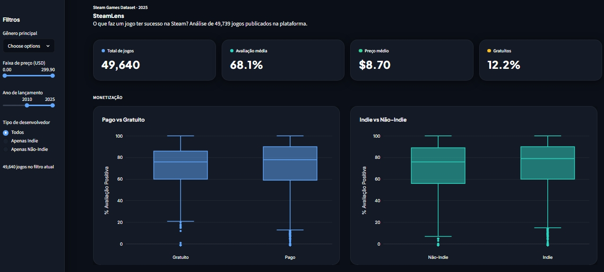
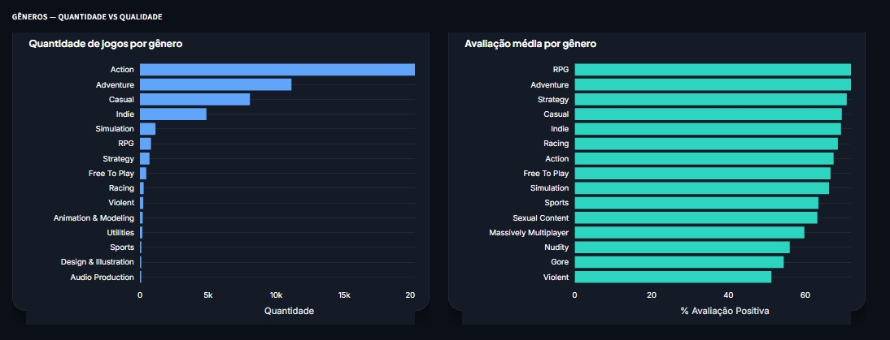
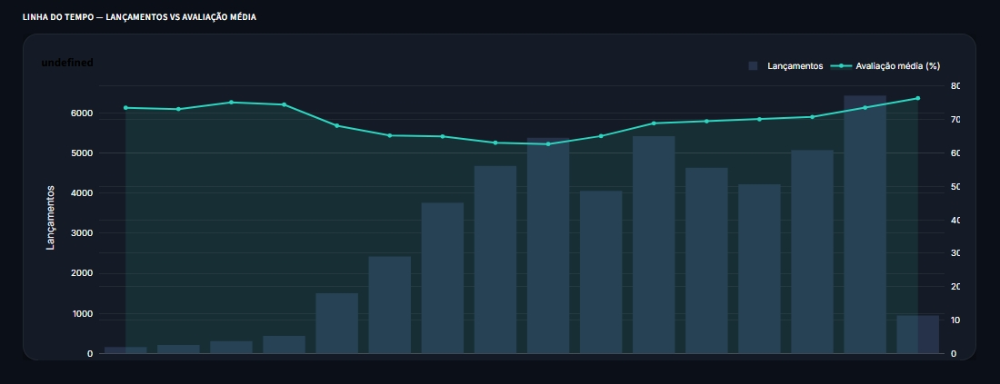
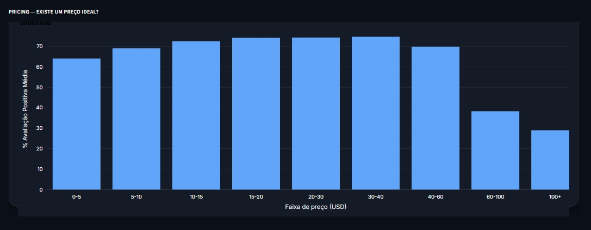
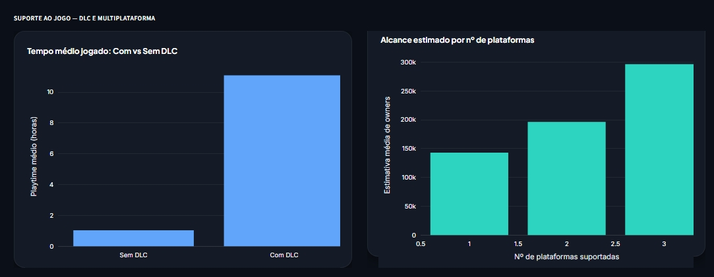

# 🎮 SteamLens

Dashboard interativo de análise exploratória sobre o que faz um jogo ter sucesso na Steam, construído com **Streamlit** e **Plotly**.

🔗 **[Acesse o Dashboard](https://steamlens-analytics.streamlit.app/)** 

---






## 📊 Sobre o projeto

O SteamLens analisa um dataset com **49.739 jogos** publicados na Steam, cruzando variáveis como preço, gênero, tipo de desenvolvedor (indie ou não), plataformas suportadas e presença de DLC para entender quais fatores se relacionam com avaliações positivas e alcance de público.

### Principais perguntas exploradas

- Jogos gratuitos têm avaliações melhores ou piores que jogos pagos?
- Jogos indie performam diferente de produções não-indie?
- Existe um gênero que se destaca em quantidade vs. qualidade?
- Existe uma faixa de preço "ideal" associada a melhores avaliações?
- DLCs e suporte multiplataforma impactam tempo de jogo e alcance estimado?

## ✨ Funcionalidades

- **Filtros interativos** por gênero, faixa de preço, ano de lançamento e tipo de desenvolvedor
- **KPIs dinâmicos** que se atualizam conforme os filtros aplicados
- **Visualizações comparativas** (boxplots, barras, séries temporais) sobre monetização, gêneros, pricing e suporte multiplataforma
- **Tabela explorável** com os jogos filtrados, ordenada por volume de avaliações
- **Tema escuro** nativo, com cards flutuantes e identidade visual customizada

## 🛠️ Tecnologias

- [Streamlit](https://streamlit.io/) — framework da interface
- [Plotly](https://plotly.com/python/) — visualizações interativas
- [Pandas](https://pandas.pydata.org/) — manipulação de dados
- [PyArrow](https://arrow.apache.org/docs/python/) — leitura de arquivos Parquet

## 📁 Estrutura do projeto

```
steamlens/
├── steamlens_dark.py        # Aplicação principal
├── requirements.txt         # Dependências do projeto
├── .streamlit/
│   └── config.toml          # Configuração de tema (dark mode)
└── data/
    └── games_clean.parquet  # Dataset tratado
```

## 🚀 Como rodar localmente

1. Clone o repositório
   ```bash
   git clone https://github.com/TayschreN/steamlens-analytics.git
   cd steamlens-analytics
   ```

2. Crie um ambiente virtual (opcional, mas recomendado)
   ```bash
   python -m venv venv
   venv\Scripts\activate  # Windows
   ```

3. Instale as dependências
   ```bash
   pip install -r requirements.txt
   ```

4. Rode o app
   ```bash
   streamlit run steamlens_dark.py
   ```

O dashboard abrirá automaticamente em `http://localhost:8501`.

## 📦 Dataset

O dataset utilizado contém informações públicas de jogos da plataforma Steam, incluindo preço, gêneros, categorias, desenvolvedores, publishers, avaliações e estimativas de número de proprietários (owners).

## 📌 Status

Projeto em desenvolvimento ativo — novas análises e visualizações podem ser adicionadas conforme o dataset evolui.

## 👤 Autor

Desenvolvido por **Gabriel** — estudante de Engenharia de Dados na UFABC.

---

*Sinta-se à vontade para abrir issues ou sugerir melhorias!*
