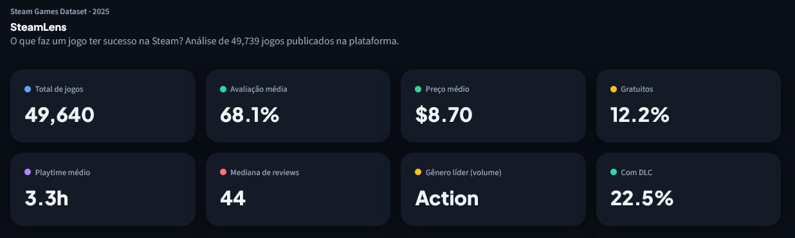
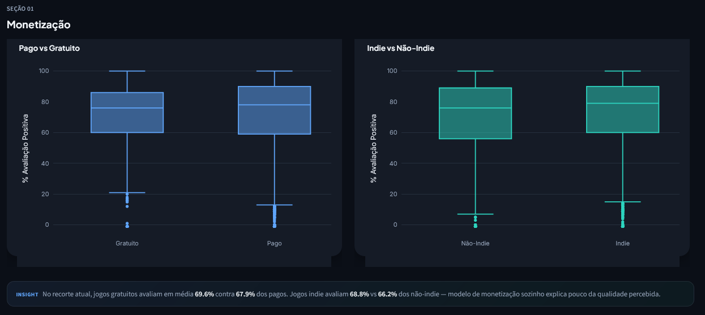
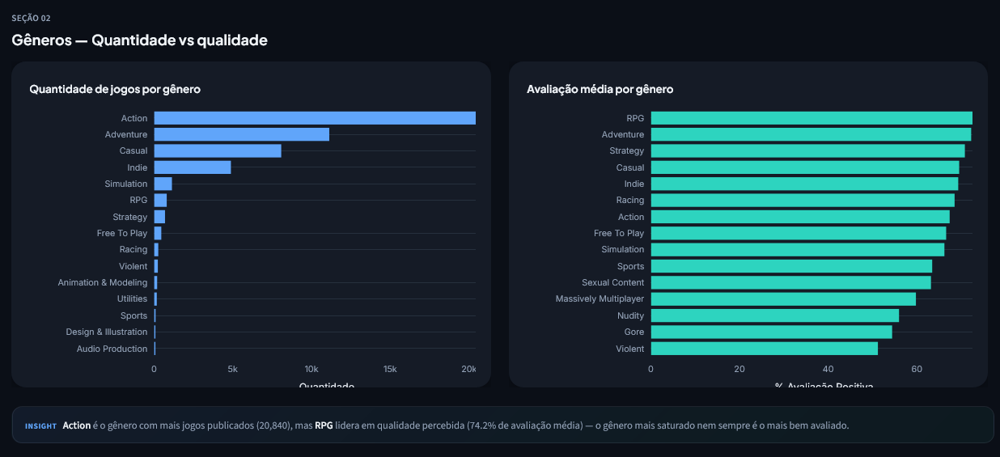
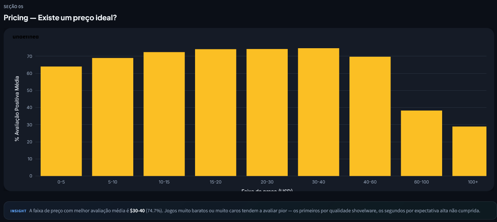
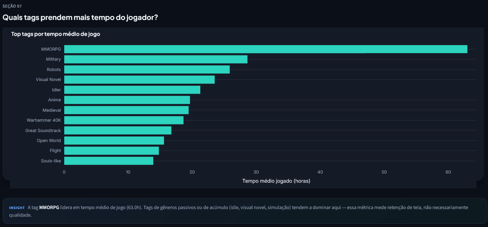

# 🎮 SteamLens — O que faz um jogo ter sucesso na Steam?

Dashboard interativo de análise exploratória sobre o que faz um jogo ter sucesso na Steam, construído com **Streamlit** e **Plotly**.

🔗 **[Acesse o dashboard ao vivo](https://steamlens-analytics.streamlit.app/)** 

---

# 🎮 SteamLens — O que faz um jogo ter sucesso na Steam?

Análise exploratória de dados e dashboard interativo sobre **49.739 jogos** publicados na Steam, buscando entender quais fatores — preço, gênero, plataforma, DLC, tipo de desenvolvedor — estão associados a melhor avaliação, maior engajamento e maior alcance.

**Fonte dos dados:** [Steam Games Dataset 2025](https://www.kaggle.com/datasets/artermiloff/steam-games-dataset) (Kaggle), arquivo `games_march2025_full.csv`.

---

## 🛠️ Stack

- **Python** (Pandas) — limpeza e manipulação
- **Seaborn / Matplotlib** — visualização exploratória (notebooks)
- **Streamlit + Plotly** — dashboard interativo final

---

## 🧹 Limpeza de dados

- Remoção de colunas de texto longo, URLs e mídia (descrições, imagens, links de suporte)
- Parse de colunas estruturadas como string (`genres`, `categories`, `developers`, `publishers`, `tags`)
- Conversão de `estimated_owners` (faixa de texto) para valor numérico médio
- Remoção de jogos com menos de 10 avaliações (ruído estatístico)
- Remoção de registros com `pct_pos_total = -1` (sentinel de "sem dado válido")
- Remoção do outlier de tag `Hentai` (volume de playtime fora da curva, distorcia análises de engajamento)
- Dataset final: **49.739 jogos**, 42 colunas

---

## 📊 Principais insights

### 1. Jogos gratuitos têm avaliações melhores que pagos?
Não significativamente. Pagos têm mediana de 78%, gratuitos 76% — a diferença é pequena. **Modelo de monetização sozinho não prediz qualidade percebida.**

### 2. Existe relação entre preço e número de avaliações?
Correlação de apenas **0.10** — praticamente nula. A maioria do volume de avaliações se concentra em jogos de $0–20, mas isso reflete volume de vendas, não qualidade.

### 3. Quais gêneros dominam em quantidade vs qualidade?
**Action** domina em volume (20.889 jogos) mas fica em 7º lugar em avaliação média (67%). **RPG** tem poucos jogos relativamente (820) mas lidera em qualidade (74%). O gênero mais saturado não é o mais bem avaliado — possível oportunidade de nicho.

### 4. Indie performa diferente de desenvolvedores grandes?
Jogos indie têm avaliação média ligeiramente superior (68,8% vs 66,3%) e são **maioria do mercado** (35.932 vs 13.841 jogos).

### 5. Lançamentos por ano: o volume cresceu? A qualidade caiu?
Sim e sim — mas com reviravolta. 2005–2008: poucos lançamentos, qualidade alta (80–88%). 2014–2018: explosão de volume (efeito Steam Greenlight/Direct), qualidade despenca a ~63%. A partir de 2019, mesmo com volume recorde (6.443 jogos em 2024), a qualidade vem se recuperando ano a ano, chegando a 76% em 2025 — sinal de melhor curadoria/descoberta na plataforma.

### 6. Existe um "preço ideal" que maximiza avaliação?
Sim: a faixa **$15–40** concentra as melhores avaliações médias (73–74%). Jogos muito baratos ($0–5) avaliam pior (64%, provável efeito shovelware), e jogos acima de $60 despencam (38% e 29%) — preço alto eleva expectativa e amplia decepção.

### 7. Crítica especializada (Metacritic) concorda com a comunidade Steam?
Correlação de **0.57** — moderada a forte. Geralmente concordam, mas a comunidade Steam tende a ser mais generosa que o Metacritic, especialmente em notas baixas/médias.

### 8. Quais categorias de jogo prendem mais tempo do jogador?
Gêneros "passivos" ou de acúmulo dominam: **Visual Novel, Idler, Anime** lideram em tempo médio jogado — não é sobre qualidade, é sobre retenção de tela.

### 9. DLC é sinal de jogo "vivo" ou só cobrar mais?
Achado forte: jogos com DLC têm playtime médio **~11x maior** e avaliação levemente melhor. DLC parece ser sinal de suporte contínuo, que por sua vez sustenta engajamento.

### 10. Suporte multiplataforma (Win/Mac/Linux) importa?
Sim. Jogos com 3 plataformas têm avaliação média maior e **estimativa de owners cerca de 2x maior** em relação a jogos single-platform — investir em portabilidade tem retorno real em alcance.

---

## 📈 Dashboard interativo

O dashboard Streamlit (`app/app.py`) traz:

- **11 seções analíticas**: monetização, gêneros, linha do tempo, preço x reviews, pricing ideal, Metacritic vs comunidade, tags mais envolventes, top desenvolvedores, DLC/plataformas, estatísticas descritivas e tabela explorável
- **Filtros dinâmicos**: gênero, faixa de preço, ano de lançamento, tipo de desenvolvedor (indie/não-indie), DLC, plataformas suportadas, mínimo de avaliações, somente jogos com nota Metacritic
- **KPIs em tempo real**: total de jogos, avaliação média, preço médio, % gratuitos, playtime médio, mediana de reviews, gênero líder, % com DLC
- **Cards de insight**: cada seção traz um resumo textual com números recalculados dinamicamente conforme os filtros aplicados

---

## 📁 Estrutura do projeto
steamlens/
├── .streamlit/
│   └── config.toml         # tema visual do dashboard
├── data/
│   ├── games_march2025_full.csv
│   └── games_clean.parquet
├── notebooks/
│   ├── 01_limpeza.ipynb
│   └── 02_eda.ipynb
├── app/
│   └── app.py               # Dashboard Streamlit
├── requirements.txt
└── README.md